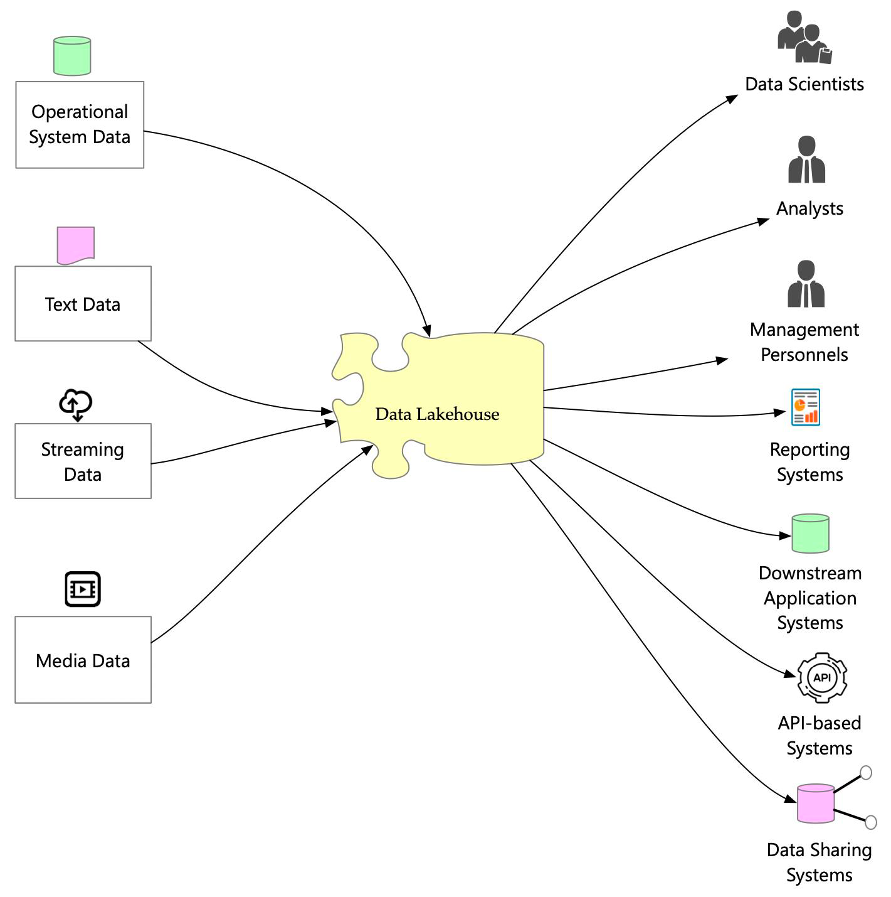
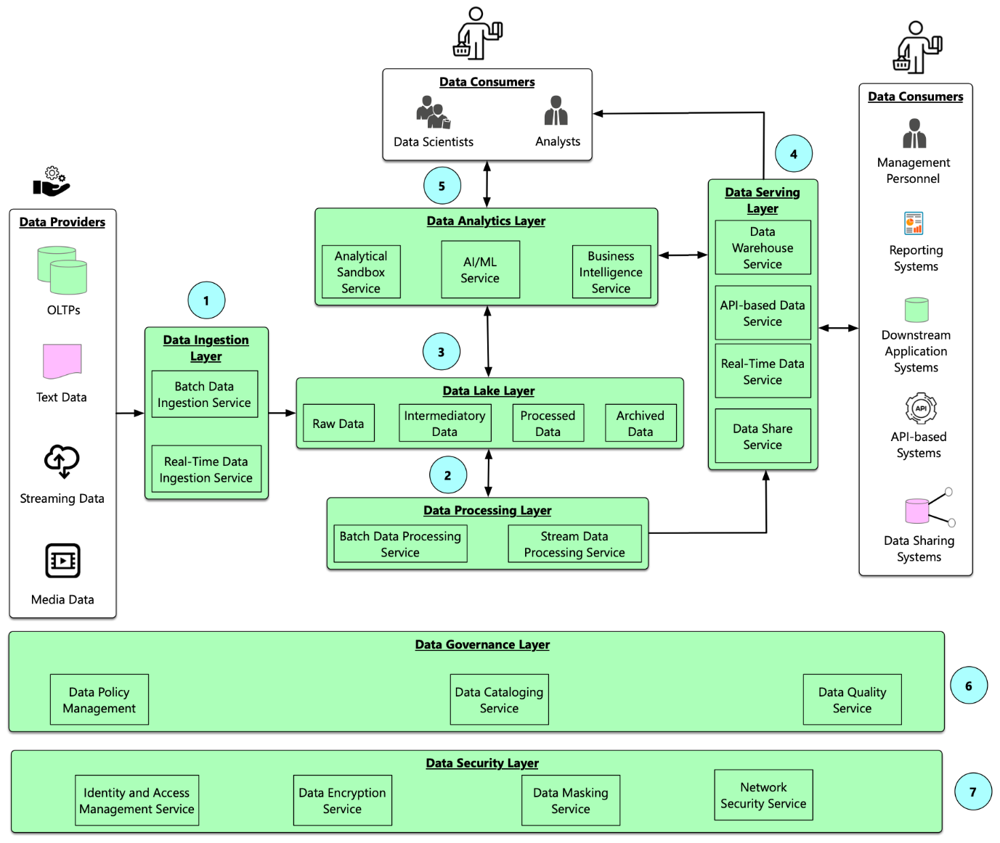

# Data Lakehouse
**Comprehensive Guide following Medallion Architecture Pattern to implement Data Lakehouse Architecture**

## Introduction
The Data Lakehouse combines the flexibility, scalability, and cost-effectiveness of Data Lakes with the structured 
data management and governance features of Data Warehouses. 
The Medallion Architecture enhances this approach by logically segmenting data into layers i.e. Bronze, silver and Gold, providing clear separation, better management, and optimized access.

### Popular Lakehouse Solutions:
* Databricks Lakehouse Platform
* Snowflake Data Cloud
* AWS Lakehouse (S3 + Redshift Spectrum/Athena/Iceberg)
* Azure Synapse Analytics

## Features
1. **Unified Storage**: Storage platform or system capable of managing diverse types of data (structured, semi-structured, unstructured), 
enabling multiple workloads (batch processing, streaming, analytics, machine learning) on a common data repository.
2. **Open Data Formats**: Standardized, publicly available formats for storing and managing data. These formats prevent vendor lock-in, 
promote interoperability, enable seamless integration across tools and platforms, and facilitate schema evolution, governance, and efficient data processing.
3. **Transactional Support (ACID compliance)**: Ensures reliable and consistent data operations, 
allowing simultaneous read/write operations without conflicts or data corruption. It is crucial for maintaining data quality, integrity, and consistency
5. **Schema enforcement**: Ensures data conforms to predefined schemas, maintaining consistency and preventing corruption. 
6. **Schema evolution**: Allows schemas to adapt seamlessly as data and business requirements change, without requiring extensive reprocessing.
7. **Data Versioning**: Refers to maintaining multiple historical states of data, enabling recovery, auditing, and reproducing analytics.
8. **Time Travel**: Is the capability to query and analyze data as it existed at specific points in time.
9.**Data Governance**:
   * Metadata Management: Captures technical, operational, and business metadata (schema, owners, timestamps, lineage).
   * Data Cataloging: Organizes datasets into searchable inventories with metadata, schema, ownership, and usage stats.
   * Business Glossary: Maintains standardized business definitions for data elements (e.g., "Customer ID").
   * Data Classification: Tags data with sensitivity or domain labels (e.g., PII, financial, public).
   * Tagging: Attaches user-defined key-value annotations for search, ownership, or processing rules.
   * Data Lineage: Tracks the full journey of data: source → transformations → consumption (tables, reports, features).
   * Data Discovery: Enables users to search and explore data assets with metadata context and quality insights.
10. **Data Quality**: Ensures the data is accurate, on time, complete, consistent, conform to specified formats, ranges, constraints and trustworthy. 
   Poor data quality leads to incorrect insights, broken ML pipelines, regulatory non-compliance, and eroded trust among users.
11. **Data Security**: Since sensitive and business-critical data lives across layers, securing it requires multi-layered, fine-grained, and auditable controls.
    * Authentication: Verifying the identity of users, services, or applications.
    * Authorization (RBAC/ABAC): Defining what resources users can access and what operations they can perform.
    * Policy Management: Centralized management of security policies via governance tools.
    * Encryption: Protecting data at rest and in transit using encryption standards (AES-256, TLS).
    * Data Masking: Obfuscating or tokenizing sensitive data (e.g., PII, PHI).
    * Auditing & Monitoring: Tracking access and modifications to data and metadata.
12. **Data Sharing and Collaboration**: Share data across teams, departments, and even external partners in a secure and reliable manner.
13. **Advanced Analytics and AI/ML Integration**: Aggregations and joins on structured data, Experimentation using notebooks, BI tools integration.
14. **Query Performance Optimization**: Efficient query performance is crucial for a well-designed Data Lakehouse. 
As data volume and concurrency grow, optimizing performance across the storage, compute, query layers becomes essential.
15. **Observability**: Ensures transparency across the entire data pipeline—from ingestion to consumption—by capturing logs, metrics, and traces from processes such as Spark, NiFi, Airflow, etc.
It allows data engineers to monitor system health, performance, debugging errors.

## Medallion Architecture Overview
The Medallion Architecture is a design pattern for organizing data in Layers within a Data Lakehouse, popularized by platforms like Databricks. 
It provides clear guidance on managing data through different stages of maturity and refinement, promoting clarity, reliability, governance, and scalability.

### 1. **Bronze Layer 🥉(Raw Data)**
Acts as a foundational raw-data store, supporting historical retention, flexibility, and initial ingestion. 
Stores raw, unaltered data directly ingested from various sources. Minimal transformation occurs here.
* Data is stored in its original format (structured, semi-structured, or unstructured).
* Often uses schema-on-read, enabling flexible ingestion.
* Append-only to preserve historical ingestion records.
* Includes data lineage and ingestion metadata (timestamps, source identifiers, ingestion details).
* Example: Raw JSON logs from web servers or streaming data from Kafka topics are ingested and stored.

### 2. **Silver Layer 🥈 (Curated Data)**
Refine and cleanse data from Bronze Layer, making it consistent, structured, and queryable. The data in this layer is considered trusted and consumable for further processing, analytics and modeling.
* Cleansed, standardized, and validated data (schema enforcement, quality checks, deduplication).
* Data schema is explicitly defined (schema-on-write), evolved appropriately with versioning.
* Supports ACID transactions to ensure data reliability and consistency.
* Includes metadata for auditability, lineage, and data quality metrics.
* Example: Raw event logs (Bronze) are cleansed, parsed, and converted into structured tables with clear schemas for further processing.

### 3. **Gold Layer 🥇 (Aggregated & Business-ready Data)**
Provides aggregated, optimized, ready to serve data for business consumption i.e. analytics, reporting, dashboards, or AI/ML usage.
•	Highly refined and optimized datasets targeted for specific use cases.
•	Data is pre-aggregated or structured to support fast and efficient queries (e.g., fact tables, dimension tables, feature stores).
•	Optimized for performance through indexing, partitioning, Z-ordering, and caching.
•	Supports strict governance, security policies, and controlled access.
•	Example: Aggregated sales data by region, customer segments, monthly financial summaries, or precomputed ML feature tables ready for analytical tools or BI dashboards.

**Relation of Medallion Architecture to Data Lakehouse Features.**
It complements and leverages key Lakehouse features as follows.

| **Lakehouse Feature**                   | **Bronze**                 | **Silver**                                    | **Gold**                                |
|-----------------------------------------|----------------------------|-----------------------------------------------|-----------------------------------------|
| **Unified Storage & Open Formats**      | Raw storage                | Curated storage                               | Optimized storage                       |
| **Transactional (ACID Compliance)**     | Basic append-only          | Strong ACID compliance                        | Strong ACID compliance                  |
| **Schema Enforcement & Evolution**      | Schema-on-read             | Schema-on-write                               | Strict schema & optimization            |
| **Data Quality Management**             | Basic validations          | Extensive validation & cleansing              | High quality & audited data             |
| **Data Versioning & Time Travel**       | Basic retention            | Versioned & auditable                         | Strict data lineage and versioning      |
| **Metadata Management & Cataloging**    | Basic ingestion metadata   | Detailed metadata, lineage, cataloged schemas | Comprehensive business metadata         |
| **Data Governance & Security**          | Broad access               | Role-based, fine-grained controls             | Strict & fine-grained security policies |
| **Streaming & Batch Processing**        | Raw batch/stream ingestion | Curated streaming/batch processing            | Batch & streaming aggregations          |
| **Advanced Analytics & ML Integration** | NA                         | Refined data for further processing           | Optimized for ML/BI                     |
| **Query Performance Optimization**      | Minimal optimization       | Moderate optimization                         | Extensive optimization                  |

## Key Design Principles
* Separation of storage and compute
* Scalability and elasticity
* Modular Architecture
* Batch and real-time data ingestion, processing and serving  

## Architecture

<b>Bird's Eye View</b>
  

  

<b>Components View</b>
  

  

### Storage
It forms the foundation of the Lakehouse and is responsible for persisting all structured, semi-structured, and unstructured data:

| **Layer** | **Storage**       | **Format/Structure**        | **Capability**                                   |
|-----------|-------------------|-----------------------------|--------------------------------------------------|
| Bronze    | MinIO             | Raw files (JSON, CSV, Avro) | Ingested data from Kafka, DBs, APIs              |
| Silver    | MinIO             | Iceberg tables (Parquet)    | Cleaned/structured data with schema & versioning |
| Gold      | Redis / Cassandra | Faster access to data       | Caching, feature serving                         |

### Table Format
**Apache Iceberg**: is an open table format designed for huge analytic datasets on cloud object stores or HDFS. 

| **Feature**                          | **Description**                                                                                                |
|--------------------------------------|----------------------------------------------------------------------------------------------------------------|
| 🔁 **ACID Transactions**             | Full support for **atomic operations** (insert, delete, update, merge) even on object stores like S3/MinIO.    |
| 🧬 **Schema Evolution**              | Supports **add, drop, rename, reorder columns** without rewriting data.                                        |
| 🕒 **Time Travel & Versioning**      | Query **historical snapshots** of data by timestamp or snapshot ID. Enables rollbacks.                         |
| 🚀 **Hidden Partitioning**           | Avoids user errors by automatically managing partition logic; no need to include partition columns in queries. |
| 🔍 **Efficient Reads with Metadata** | Maintains rich metadata (manifest files) to **prune files**, reducing scan costs significantly.                |
| 📈 **Incremental Reads**             | Supports **incremental queries** (what changed since X). Great for downstream pipelines or CDC.                |
| 🧱 **Multi-engine Support**          | Native support in **Apache Spark, Flink, Trino, Presto, Dremio, Hive** etc.                                    |
| 🔐 **Cloud & Object Store Friendly** | Optimized for S3, GCS, Azure Blob, MinIO — avoids file listing issues like Hive.                               |
| 📚 **Write Isolation**               | Writers do not interfere with each other. Iceberg uses snapshot isolation and atomic metadata commit.          |
| ⚙️ **Compaction & Optimization**     | Supports background jobs for **compaction, rewrite, sort, and clustering**.                                    |

**Alternatives**: Delta Lake, Apache Hudi

### Data Ingestion
#### Types of Data Sources
| **Source Type**   | **Examples**                                                       |
|-------------------|--------------------------------------------------------------------|
| **Files**         | CSV, JSON, Parquet, Avro, ORC from local disk, S3, GCS, HDFS, etc. |
| **RDBMS**         | PostgreSQL, MySQL, SQL Server, Oracle                              |
| **NoSQL**         | MongoDB, Cassandra, DynamoDB                                       |
| **Kafka/Streams** | Apache Kafka, AWS Kinesis, Azure Event Hub                         |
| **IoT & Sensors** | MQTT, CoAP, Edge Gateways (via Kafka, MQTT brokers, HTTP APIs)     |
| **APIs**          | REST, SOAP, GraphQL                                                |

#### Tools & Technologies by Source Type
1. **Files**
   * Apache NiFi: Drag-drop flow-based batch/stream ingestion
   * Apache Airflow: Orchestrate periodic file ingestion (S3, GCS, FTP)
   * Kafka streams / Spark Structured Streaming for real-time
2. **Databases**
   * Batch Mode
     *  Apache Airflow + JDBC + Spark: Scheduled jobs using JDBC reader
   * Real-time (CDC)
     *  Debezium + Kafka Connect: Capture DB change logs
     *  Kafka topics → Stream ingestion
     *  Apache Flink/Spark Structured Streaming
4. **Kafka/Event Streams**
   * Kafka Connect → HDFS/S3 Sink Connectors
   * Spark Structured Streaming
   * Flink (if using event time, windowed aggregations)
5. **IoT and Sensor Data**: IoT → MQTT broker → Kafka or HTTP POST
   * Apache NiFi: MQTT processors
   * Kafka or Apache Pulsar for streaming
   * Edge → Cloud ingestion via protocol converters
6. **API Sources**
   * Apache NiFi: InvokeHTTP processor for polling APIs
   * Airflow DAGs: Scheduled API extraction
   * Custom ingestion microservices: Push to Kafka or Bronze

### Compute Engine
The Compute Layer powers processing, querying, experimentation, analytics, and ML workloads.

| **Tool**          | **Purpose**                        | **Features**                                                                                                                                   |
|-------------------|------------------------------------|------------------------------------------------------------------------------------------------------------------------------------------------|
| Apache Spark      | Distributed data processing        | Batch & stream processing                                                                                                                      |
| Apache Airflow    | Workflow orchestration             | DAG scheduling, Spark job orchestration, Rich plugin/operator ecosystem                                                                        |
| Trino             | Federated SQL query engine         | ANSI SQL on Iceberg, Hive, RDBMS, Kafka. Supports BI tools. Jupyter integration via SQL magic Fast ad-hoc analytics.                           |
| Jupyter Notebooks | Data exploration & experimentation | Interactive Spark & Trino queries, Feature engineering, Visualization, ML experimentation & debugging                                          |
| MLflow            | ML lifecycle management            | Tracks parameters, metrics, artifacts. Model registry & versioning. Reproducible experiments. REST model serving                               |
| Feast             | Feature store                      | Centralized feature definitions.Offline store: Iceberg, Online store: Cassandra, Redis. Batch & streaming ingestion, Real-time feature serving |

### Data Governance
**OpenMetadata**: OpenMetadata offers a comprehensive, extensible, and modern open-source solution for unified data governance, blending automation, collaboration, and observability.  

| **Feature**                    | **Capabilities**                                                                                                                                                              |
|--------------------------------|-------------------------------------------------------------------------------------------------------------------------------------------------------------------------------|
| **Metadata Management**        | Centralized repository for technical, operational, and business metadata. Supports tables, topics, dashboards, pipelines, ML models                                           |
| **Cataloging**                 | Auto-discovery and registration of metadata from vast variety of connectors. Version-controlled metadata with changelogs                                                      |
| **Business Glossary**          | Define business terms, descriptions, owners. Link glossary terms to datasets, columns, and metrics. Support for hierarchical glossaries                                       |
| **Classifications**            | Define classification policies e.g. PII, sensitive data. Apply to columns and datasets for compliance tracking.                                                               |
| **Tagging**                    | Add tags manually or through automated classification. Organize and search data assets more effectively                                                                       |
| **Lineage**                    | Automatic lineage capture across ingestion pipelines. End-to-end lineage visualization at table-level, column-level, process-level. Supports Spark, Airflow, dbt, Kafka, etc. |
| **Data Discovery**             | Faceted search across all metadata. Semantic search with glossary and tags. Context-rich asset pages with lineage, ownership, and usage                                       |

Alternatives: Apache Atlas, Marquez

### Data Security and Access Control
**OpenMetadata**: provides a robust, enterprise-ready security model that balances data democratization with controlled access and compliance.

| **Feature**                          | **Capabilities**                                                                                                                                  |
|--------------------------------------|---------------------------------------------------------------------------------------------------------------------------------------------------|
| **Role-Based Access Control (RBAC)** | Assign roles like Admin, Data Steward, Data Consumer, etc. Built-in and custom role definitions. Control over CRUD operations on metadata objects |
| **Fine-Grained Policies**            | Define access at entity, field, or action level e.g. view-only access to sensitive tables. Policies scoped by teams, roles, or users              |
| **Teams and Ownership**              | Logical grouping of users into teams. Assign ownership of assets (tables, dashboards, pipelines, etc.) to users or teams                          |
| **Authentication Integrations**      | Supports Single Sign-On (SSO) via OAuth2 / OIDC (e.g., Okta, Auth0), LDAP, Google, Azure AD, SAML (in roadmap or via plugins)                     |
| **Audit Logging**                    | Tracks user actions on metadata assets. Logs view, edit, test runs, classification changes for compliance audit                                   |
| **Sensitive Data Classification**    | Use policies and tags (e.g., PII, Confidential) to restrict access. Combined with lineage and tagging for data protection flows                   |
| **API Token Management**             | Generate access tokens with scoped permissions for automated systems or CLI tools                                                                 |
| **Metadata Encryption**              | Secures metadata and secrets with encryption at rest and in transit (TLS/HTTPS)                                                                   |
| **Schema Change Alerts**             | Notify stakeholders on schema or classification changes that may affect downstream use                                                            |

> [!IMPORTANT]
> Each role should be defined in a centralized IAM system (e.g., Keycloak, Active Directory etc.), and mapped to policies in Authentication provider or the equivalent data access layer.

#### Following are the roles as per convention
1. **Data Security Officer (DSO)**: Policy admin, audit logs, compliance dashboard access.
   * Owns the data security policy across the organization.
   * Ensures compliance with external regulations (e.g., GDPR, HIPAA).
   * Defines RBAC policies and reviews access logs and audit trails.

2. **Data Steward**: Metadata editing, lineage access, catalog tagging.
   * Manages data classification, sensitivity levels, tagging (e.g., PII, confidential).
   * Works with DSO to ensure data is categorized correctly.
   * Ensures metadata is accurate and secure.

3. **Data Owner (Business/Domain Owner)**: Approver in access request workflows, policy contributor.
   * Accountable for the security, access, and usage of specific data domains (e.g., finance, HR).
   * Approves data access requests.
   * Works with stewards to tag sensitive data and set access policies.

4. **Data Engineer**: Read/write to Bronze/Silver layers, limited access to Gold.
   * Implements ingestion, transformation, and processing pipelines.
   * Ensures sensitive data is masked, encrypted, or filtered before downstream use.
   * Implements row/column-level security where applicable.

5. **Data Analyst/Scientist**: Read-only access to Gold/Silver, request-based access to sensitive datasets.
   * Consumes curated data (Silver/Gold) for analytics and ML.
   * Should not have access to raw data (Bronze) or PII without approval.

6. **ML Engineer/ML Ops**: Read/write access to feature stores, metadata access, monitoring logs.
   * Consumes features from Feast, trains/serves models.
   * Requires access to offline (Iceberg) and online (Redis, Cassandra) feature stores.
   * Must ensure models do not leak sensitive attributes (e.g., inferential re-ID).

7. **Platform Administrator/DevOps**: Cluster admin, but no direct data access by default.
   * Manages infrastructure, including Spark on Kubernetes, MinIO, Trino.
   * Sets up authentication and integrates with Authentication Provider.
   * Ensures encryption in transit and at rest.

8. **Auditor/Compliance Officer**: Read-only access to audit logs and policy definitions.
   * Periodically reviews access logs, lineage, and policy violations.
   * Ensures adherence to audit and retention policies.

### Data Quality
**OpenMetadata**: OpenMetadata’s Data Quality module is ideal for continuous, observable, and governance-aligned validation of data pipelines.

| Feature                                 | Description                                                                |
|-----------------------------------------|----------------------------------------------------------------------------|
| **Test Suite Management**               | Define and manage data quality test suites linked to tables or columns     |
| **Inbuilt Test Types**                  | Supports out-of-the-box tests: null checks, uniqueness, value ranges, etc. |
| **Custom Tests (SQL/Python)**           | Define custom quality checks using SQL or Python                           |
| **Integration with Great Expectations** | Leverage GE tests natively inside OpenMetadata                             |
| **Test Scheduling**                     | Automate test execution via ingestion workflows                            |
| **Test Result Tracking**                | Track historical test runs and surface failures                            |
| **Column-level Expectations**           | Apply data quality rules at granular schema levels                         |
| **Alerting & Notification**             | Trigger alerts via Slack, email, or webhook on test failures               |
| **Visual Dashboard**                    | Monitor test coverage and status with visual widgets                       |
| **Lineage-Aware Quality Context**       | Connect test failures to upstream/downstream data via lineage graphs       |
| **Integration with Airflow**            | Use Airflow to schedule and run tests as part of ETL/ELT pipelines         |

### Observability
**OpenMetadata**:  Following features make OpenMetadata not just a governance layer but a living control plane for data reliability and operational awareness.

| **Feature**                     | **Capabilities**                                                                                                                                                                    |
|---------------------------------|-------------------------------------------------------------------------------------------------------------------------------------------------------------------------------------|
| **Usage Tracking**              | • Tracks query counts, frequent access patterns, user activity on tables, dashboards, etc. • Supports integrations with usage logs from tools like Snowflake, BigQuery, Redshift |
| **Data Profile Statistics**     | • Automatically captures min/max, null count, distinct count, mean, median, etc. • Helps understand distribution and anomalies in data                                           |
| **Data Quality Monitoring**     | • Test execution status over time • Visual dashboards for pass/fail trends, test coverage                                                                                        |
| **Data Lineage Insights**       | • Identify stale/unused data via lineage traversal • Trace impact of upstream changes                                                                                            |
| **Ingestion Health Monitoring** | • Status of metadata/data ingestion workflows • Retry and error logging for failed sources                                                                                       |
| **Change Events & Versioning**  | • Tracks schema changes, test result variations, ownership changes • Supports diff views across metadata versions                                                                |
| **Alerts & Notifications**      | • Alert on test failures, schema changes, access events via Slack, email, or webhooks                                                                                               |
| **Dashboards & Visuals**        | • UI widgets for top datasets by access, asset health, and test results • Provides asset-level quality and usage scorecards                                                      |

## References
- [Open Metadata](https://open-metadata.org/)
- [Access Control for Open Metadata](https://blog.open-metadata.org/building-access-control-for-openmetadata-5b842a2abd90)
- [Apache NiFi](https://nifi.apache.org/)
- [Apache Airflow](https://airflow.apache.org/)
- [Apache Flink](https://flink.apache.org/)
- [Apache Atlas](https://atlas.apache.org/)
- [Apache Ranger](https://ranger.apache.org/)
- [Kafka](https://kafka.apache.org/)
- [Kafka Connect](https://docs.confluent.io/platform/current/connect/index.html)
- [Kafka Streams](https://kafka.apache.org/documentation/streams/)
- [Debezium](https://debezium.io/)
- [MinIO](https://min.io/)
- [Apache Iceberg](https://iceberg.apache.org/docs/nightly/)
- [Apache Iceberg Spark Quickstart](https://iceberg.apache.org/docs/1.9.0/java-api-quickstart/)
- [Apache Hadoop](https://hadoop.apache.org/)
- [Apache Hive](https://hive.apache.org/)
- [Spark Documentation](https://spark.apache.org/docs/latest/).
- [Spark Configuration Documentation](https://spark.apache.org/docs/latest/configuration.html)
- [Spring boot starter for Spark](https://github.com/officiallysingh/spring-boot-starter-spark).
- [Apache Hadoop and Hive installation guide](https://medium.com/@officiallysingh/install-apache-hadoop-and-hive-on-mac-m3-7933e509da90) for details on how to install Hadoop and Hive.
